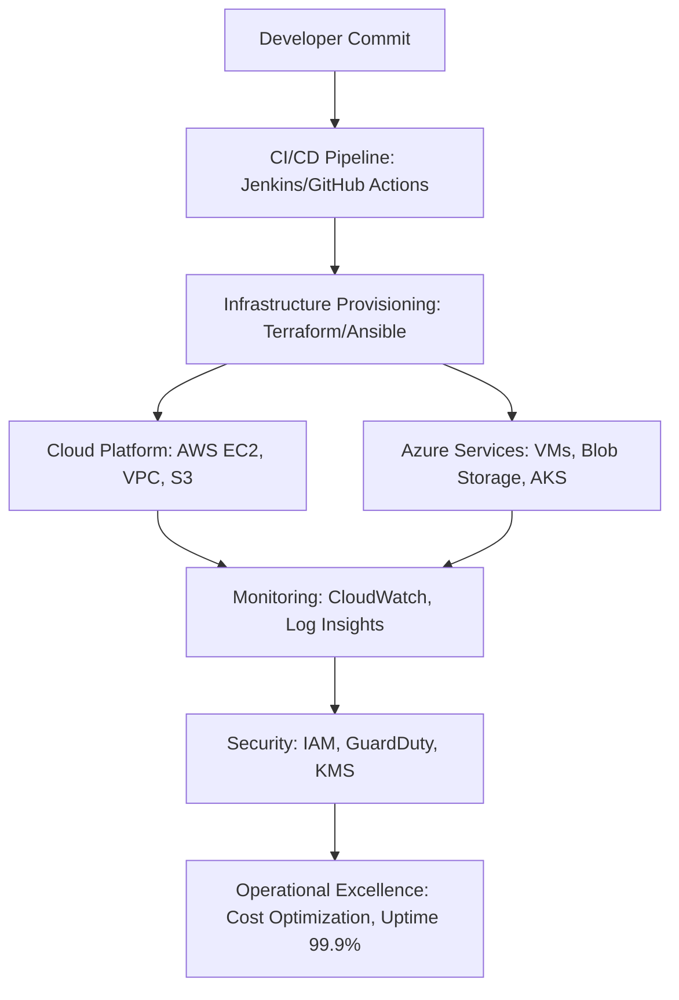

# Alice Blanche Ekane

### 🌐 ABOUT ME
- Senior AWS Infrastructure Engineer / Site Reliability Engineer
- 6+ years architecting, automating, and securing enterprise-scale cloud environments.
- Multi-cloud exposure (AWS + Azure), IaC (Terraform, Ansible), CI/CD (Jenkins, GitHub Actions),
- and AI/ML integration (LLMs, anomaly detection, OpenAI SDK).
- US Citizen — no sponsorship required.

📧 Contact Me

[](mailto:aliceekane04@gmail.com)  
[](https://www.linkedin.com/in/alice-ekane/)  
[](https://github.com/aliceekane)  

📊 SKILLS SNAPSHOT


📄 RESUME & CERTIFICATIONS

[](https://github.com/aliceekane/aliceekane-portfolio/blob/main/Alice_Resume.pdf)

📜 Official AWS Certificates:
- [AWS Certified Solutions Architect – Associate](https://github.com/aliceekane/aliceekane-portfolio/blob/main/AWS%20Certified%20Solutions%20Architect%20-%20Associate%20certificate.pdf)
- [AWS Certified Cloud Practitioner](https://github.com/aliceekane/aliceekane-portfolio/blob/main/AWS%20Certified%20Cloud%20Practitioner%20certificate.pdf)

```
###🚀 CAREER HIGHLIGHTS
- Reduced annual cloud spend by 18% through AWS resource optimization
- Improved healthcare application uptime to 99.9% with hybrid networking
- Accelerated deployments by 35% across 50+ environments (Terraform + Ansible)
- Enhanced anomaly detection efficiency by 26% using LLMs + OpenAI SDK
- Mentored junior engineers in AWS automation and DevOps best practices

🛠 PORTFOLIO PROJECTS
- Cloud Cost Optimization Dashboard (Django + Pandas visualization)  
- Hybrid Cloud CI/CD Pipelines (Terraform + GitHub Actions)  
- Anomaly Detection with LLMs (OpenAI SDK integration)
----

### 🖼 Textual Diagram (ASCII style)
+-------------------+        +-------------------+
|   Developer       |        |   Cloud Platform  |
|   (Code Commit)   |        |   AWS / Azure     |
+---------+---------+        +---------+---------+
          |                            |
          v                            v
+-------------------+        +-------------------+
|   CI/CD Pipeline  | -----> |   Infrastructure  |
|   (Jenkins/GitHub)|        |   (Terraform/Ansible) |
+---------+---------+        +---------+---------+
          |                            |
          v                            v
+-------------------+        +-------------------+
|   Monitoring      |        |   Security        |
|   (CloudWatch)    |        |   IAM / GuardDuty |
+-------------------+        +-------------------+

----------------------------------------------
```
### 🖇 Mermaid Diagram (Cloud Workflow)

### ✨ HOW TO USE THIS PORTFOLIO
- Review career highlights for measurable achievements  
- Explore skills and certifications for technical expertise  
- Check portfolio projects for hands-on cloud automation demos  
- Connect on LinkedIn for collaboration or opportunities
